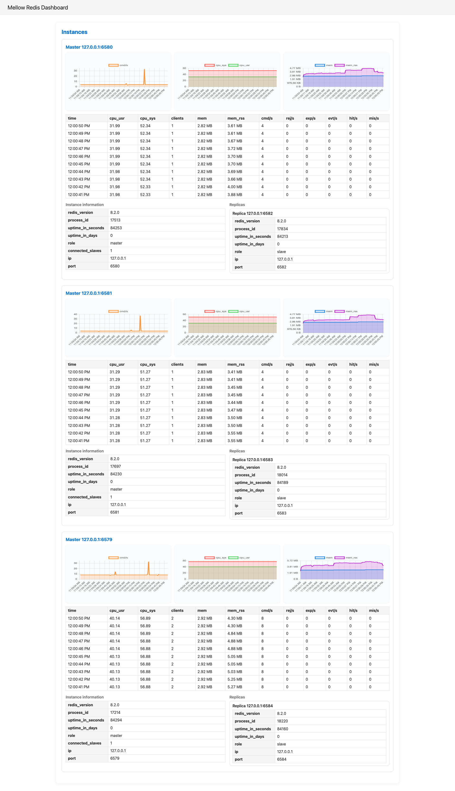

# Mellow Redis Dashboard

A real-time dashboard for visualizing Redis metrics.  
You can monitor command throughput, CPU, memory usage, and instance information with charts and tables.

## Screenshot

- Top: charts for cmd/s, CPU, and memory metrics
- Middle: recent metrics history table
- Bottom: Redis instance information

## Usage

1. Start the server.
2. Open your browser and access `http://127.0.0.1:8080/`.
3. The dashboard will be displayed.

## Features

- Real-time Redis metrics visualization
- Charts for command throughput, CPU, and memory usage
- Recent metrics history table
- Instance information table
- Prometheus metrics endpoint

## License

MIT
